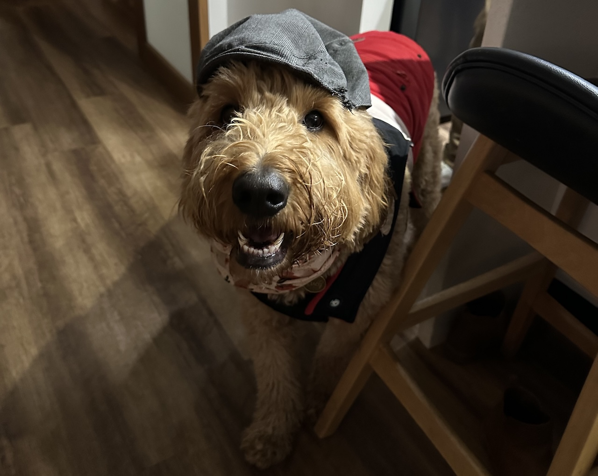
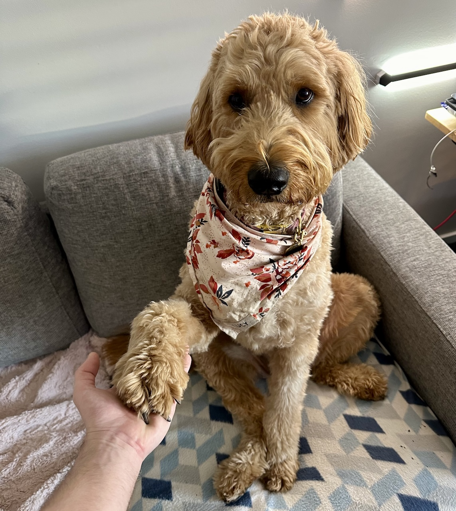
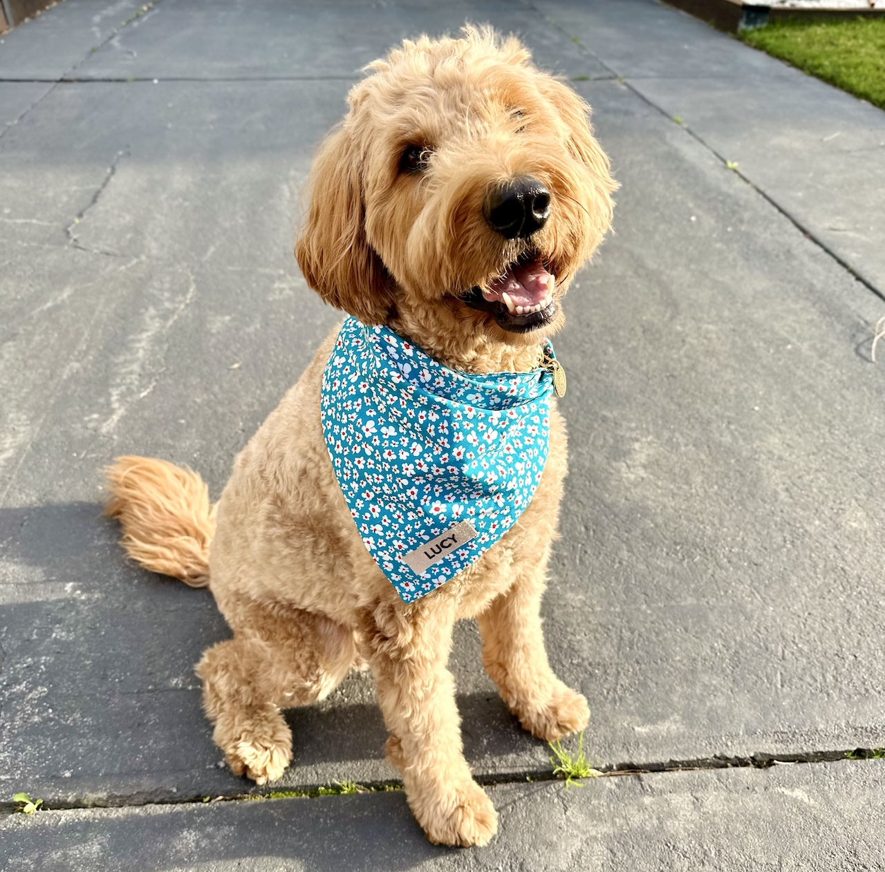

This post is really just to serve as a personal time capsule/list of things I did in 2024 that I will likely come back to read in the distant future. If you're reading this and you're not me, thanks for being here!

## Job/Career
- Glean: Solutions Engineering Lead, APAC

I've been lucky enough to be put into a position to lead my own small team across APAC which has seen me go from being the only engineer in APAC, to one of 4 across Australia, India, and Japan.

## Places I Travelled

I travelled a ton this year. Even though it was mostly all for work, I loved just about every second of it. I was away (almost) every month at some point. If the trip was for work (all except for Bali and Heathcote), I would try my best to add a day either side to explore and make the most of being abroad.

I also managed to hit OneWorld Emerald and Accor Diamond for the first time.

While I'll likely still travel in 2025, I anticipate this to be far less frequent, and more local to Australia: Bittersweet, as I absolutely adored going to both Japan and Singapore frequently.

| Month     | Places Visited                                                          |
| --------- | ----------------------------------------------------------------------- |
| January   | Singapore 💼                                                             |
| February  | USA (SF 💼)                                                              |
| March     | Japan (Tokyo 💼, Yokohama 🌴)                                             |
| April     | Singapore 💼                                                             |
| May       | Indonesia (Bali 🌴)                                                      |
| June      | Japan (Fukuoka 🌴, Miyajima/Hiroshima 🌴, Tokyo 💼, Kawaguchi/Fuji-san 🌴)  |
| July      | -                                                                       |
| August    | Japan (Yokohama 💼, Tokyo 💼), Australia (Brisbane 💼), USA (Lake Tahoe 💼) |
| September | -                                                                       |
| October   | Australia (Sydney 💼)                                                    |
| November  | Australia (Sydney 💼)                                                    |
| December  | Australia (Sydney 💼, Heathcote/Nagambie 🌴)                              |

## Games I Played
* Slay The Spire
* Risk of Rain
* Chrono Ark
* Dome Keeper
* Windblown
* Death Must Die
* Destiny 2: The Final Shape
* Balatro
* Astrobot

Chrono Ark was probably GOTY for me out of all of the above. A hidden gem with a story that kept me hooked, and a great OST.

Most of my gaming this year was done on a ROG Ally (Z1E) rather than a console, and I trended heavily towards indies rather than AAA.

## Content I Watched
I've inadvertantly shifted most of my watching to YouTube! Maybe this was due to heavy travel? I never thought I'd be that type of person, but here we are.

### TV Shows
* Star Wars: The Clone Wars (S1-7)
* Doctor Who (S14/S1)
* Clarkson's Farm (S3)

### YouTube
* Abroad in Japan
* Trash Taste Specials
* Noel Phillips
* SkillUp
* CDawgVA
* Penguinz0 / Moist
* Lewis Spears
* PremierTwo
* Gamers Nexus
* LTT / TechLinked
* Retro Game Corp

### Podcasts
* WAN Show (weekly)
* Trash Taste (weekly)
* Abroad in Japan Podcast (twice-weekly)
* The Yard (on-demand)

## Health
- Continuing to train/gym 3x per week consistently. I still loathe going, but I'm at the point now where I feel even worse if I don't go.

## Education
- Put a big effort into learning Japanese due to work (most of my corporate travel was to Japan this year).
  - I'm still going through phases of motivation with it. Immersion is definitely key: When I'm over there I'm driven to study, however when I'm back home - not so much.
  - I completed 3 terms of online classes, but stopped towards the end of the year, as I was beginning to fall behind (not devoting enough time to doing the homework throughout the week).
  - I really want to get to a point where I can hold a conversation with a colleague, but I think I need to change my approach to learning first: Even Duolingo has worn off its appeal.

## Lucy
- Continued weekly dog training lessons with Lucy (total ~18 months). She's about to move to Level 3!
  - While she still has her usual attitude, I've noticed a massive change in her behaviour since we first started.
  - It is a major drive (~1hr each way) every Saturday for a class, but it has been working for her (whereas more local classes didn't), so we'll continue.

### 2024 Lucy Pics

